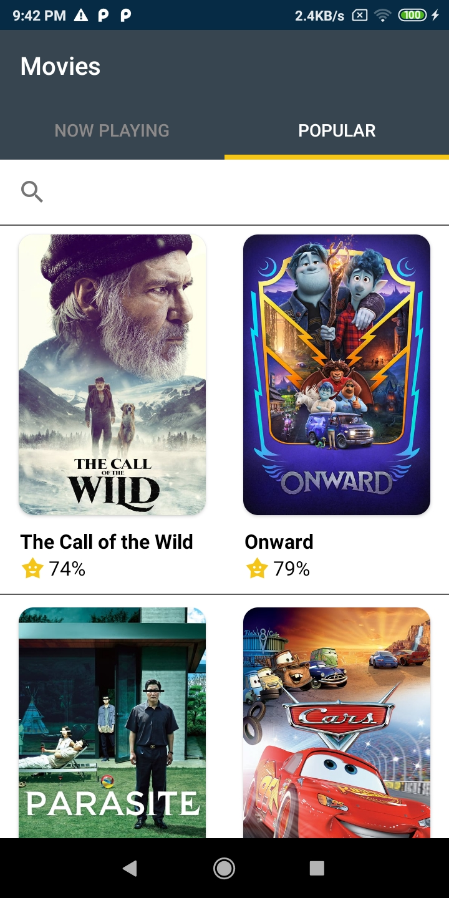
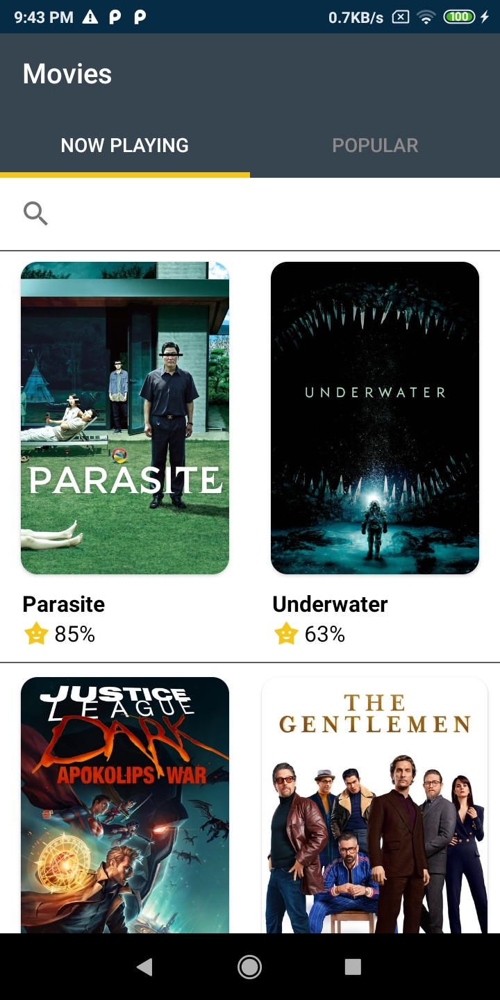
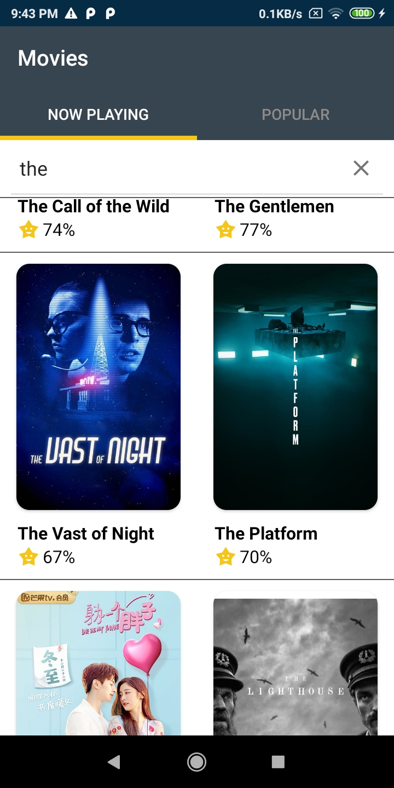
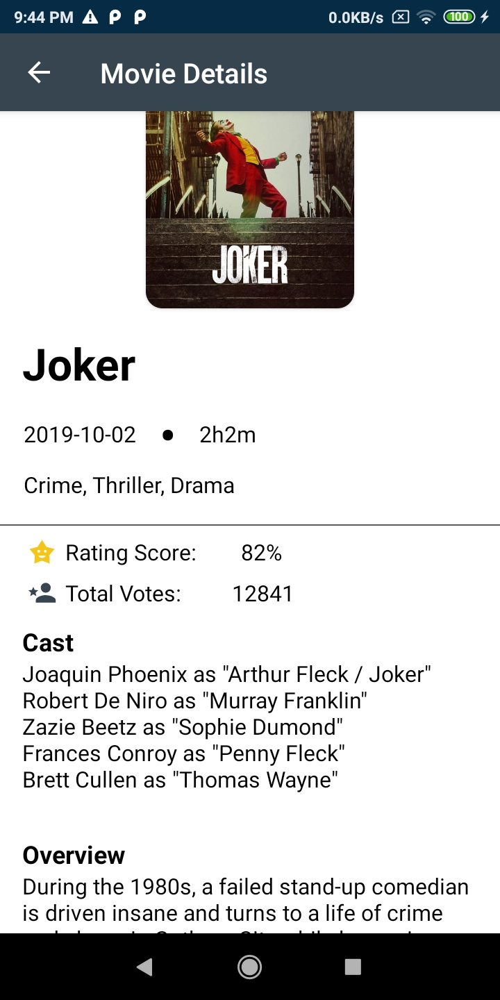

<h1 align=center> MovieApp </h1>

<g-emoji class="g-emoji" alias="cyclone" fallback-src="https://github.githubassets.com/images/icons/emoji/unicode/1f300.png">🌀</g-emoji>
 Simple app to fetch Movies as per categories from tmdb API 
<g-emoji class="g-emoji" alias="cyclone" fallback-src="https://github.githubassets.com/images/icons/emoji/unicode/1f300.png">🌀</g-emoji>

  

<b>Features:</b>
<ul>
  <li>Fetch movies from tbdb API</li>
  <li>TabLayout for different categories - Now Playing, Popular</li>
  <li>App-level search</li>
  <li>Movie details page - movie poster, cast, etc</li>
</ul>
 
   
<h2>Screens: </h2> 
 

 
 

 
 

  
<i> *Requires generation of API key from tmdb website (only after registering)</i>

